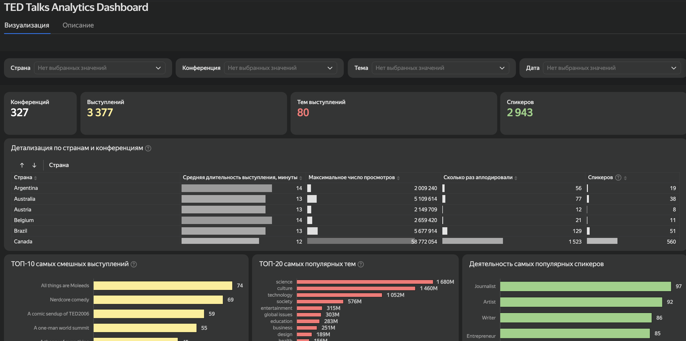
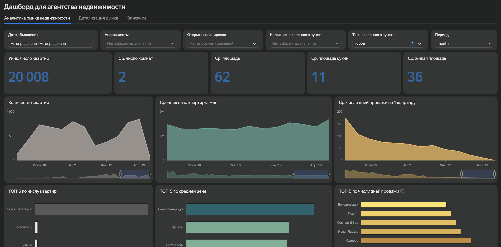
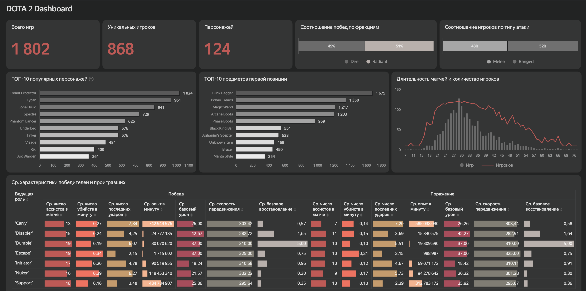

# Дашборды в Yandex DataLens

Интерактивные дашборды, собранные в Yandex DataLens: KPI-карточки, фильтры и
параметры-селекторы, вычисляемые поля, разные типы визуализаций и таблицы с
детализацией. Ниже — превью каждого дашборда; **клик по картинке открывает
живой интерактивный дашборд**.

## TED Talks — аналитика выступлений

Дашборд по выступлениям TED: ключевые показатели (конференции, выступления,
темы, спикеры), детализация по странам, топ популярных тем, топ спикеров по
роду деятельности и топ «самых смешных» выступлений. Есть фильтры по стране,
конференции, теме и дате.

## Рынок недвижимости — дашборд для агентства

Дашборд по рынку недвижимости Санкт-Петербурга и Ленинградской области:
KPI (число квартир, средние площадь, число комнат, площадь кухни), динамика
количества объявлений, средней цены и срока продажи по месяцам, топ-5 городов
по числу квартир, средней цене и сроку продажи. Фильтры по дате, типу
населённого пункта, планировке и параметр-селектор грануляции периода.

## DOTA 2 — игровая аналитика

Дашборд по матчам DOTA 2: KPI (число игр, уникальных игроков, персонажей,
соотношение побед по фракциям и типам атаки), топ-10 популярных персонажей и
предметов первой позиции, распределение длительности матчей и таблица средних
характеристик победителей и проигравших по ролям.

## Использованные приёмы

- KPI-карточки с ключевыми метриками
- Фильтры и параметры-селекторы, действующие на все чарты дашборда
- Вычисляемые поля на основе исходных данных
- Разные типы визуализаций: столбчатые и линейные диаграммы, площадные
  графики, таблицы с внутренними барами и условным форматированием
